```markdown
# PRODMONDE
### Cartographie interactive de l'évolution mondiale des grandes cultures (1961–2024)

> Application web de visualisation interactive analysant la production agricole mondiale
> (blé, riz, maïs, soja, canne à sucre, orge, pommes de terre, palmier à huile, ignames)
> entre 1961 et 2024, à partir des données FAOSTAT.

| 🚀 Démo | 📓 Observable | 📊 Données | 📄 Rapport |
|---|---|---|---|
| [bamisholaloke.com/prodmonde/](https://bamisholaloke.com/prodmonde/) | [Notebook](https://observablehq.com/d/8eb132f2244bd233) | [FAOSTAT QCL](https://www.fao.org/faostat/en/#data/QCL) | [rapport_visu_PRODMONDE.pdf](./rapport_visu_PRODMONDE.pdf) |

---

## 📸 Aperçu — Dashboard

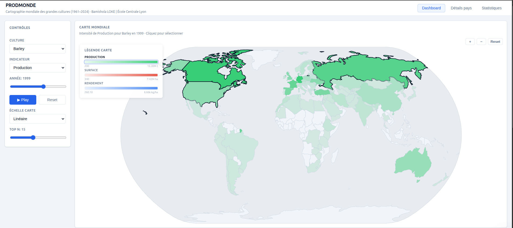
*Carte choroplèthe — Production d'orge en 1999 (échelle linéaire)*

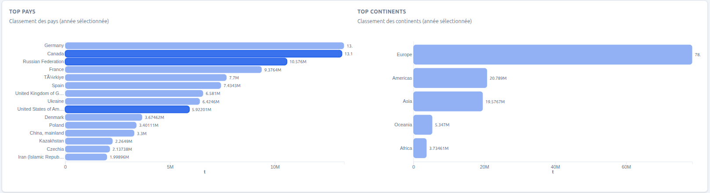
*Classements Top Pays et Top Continents — Orge · Production · 1999*

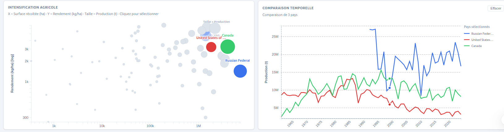
*Scatter d'intensification agricole et comparaison multi-pays — Russie, États-Unis, Canada · 1999*

---

## 📸 Aperçu — Détails pays & Statistiques

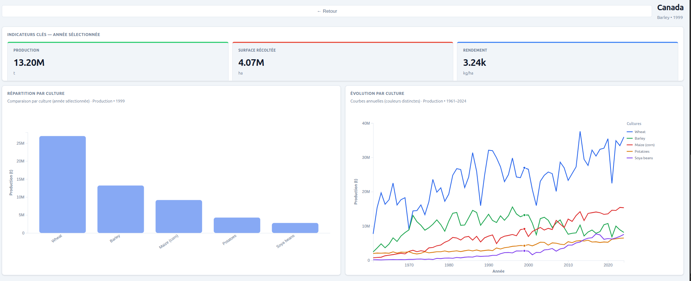
*Page Détails pays — Canada · Orge · 1999 — KPI cards, bar chart par culture, line chart multi-cultures*

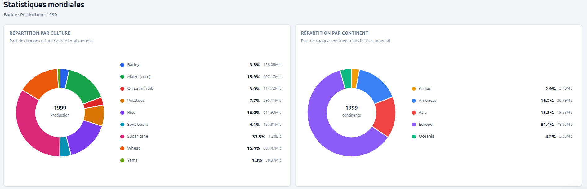
*Page Statistiques — répartition par culture et par continent · 1999*

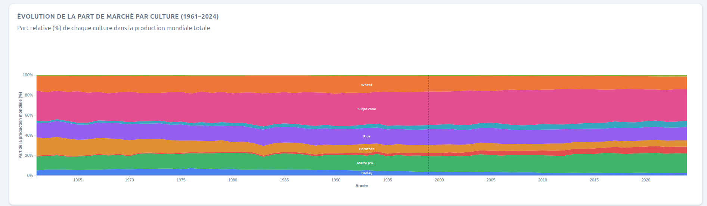
*Évolution des parts de marché relatives par culture (1961–2024)*

---

## 🗺️ Démarche de conception

### Exploration des données (Observable)

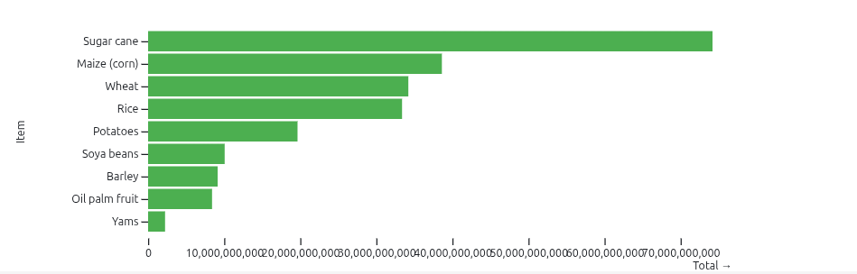
*Production totale mondiale par culture (1961–2024) — Observable*

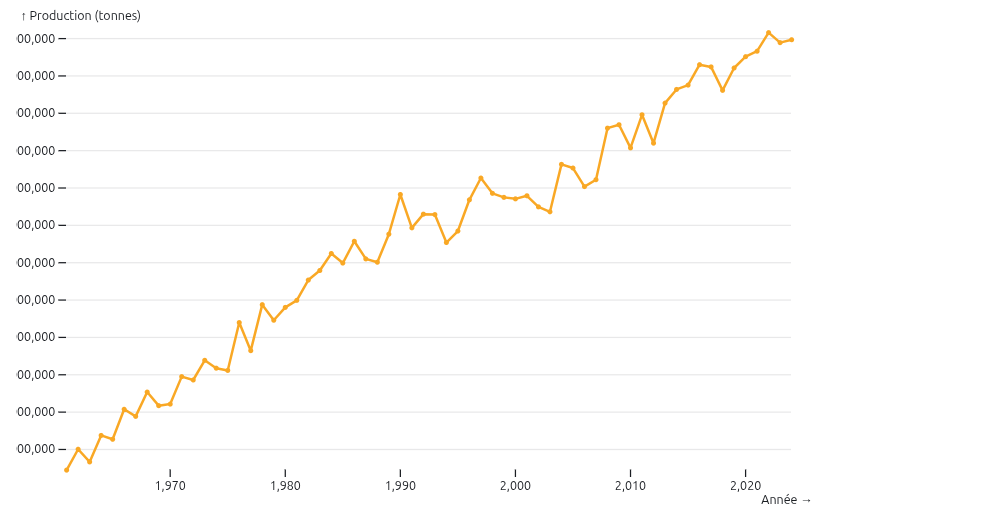
*Évolution de la production mondiale de blé (1961–2024) — Observable*

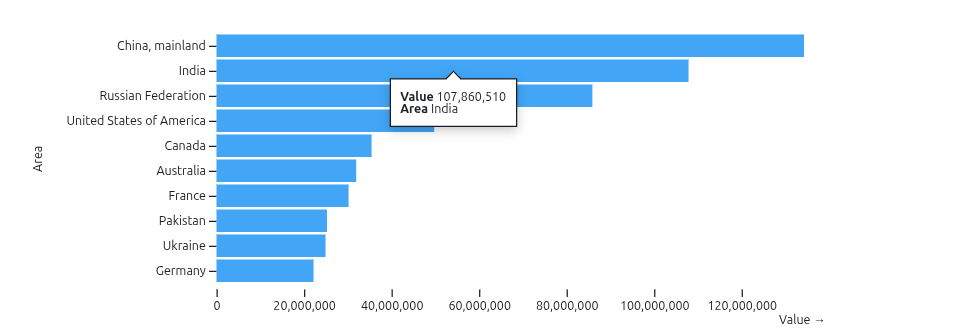
*Top 10 producteurs de blé en 2020 — Observable*

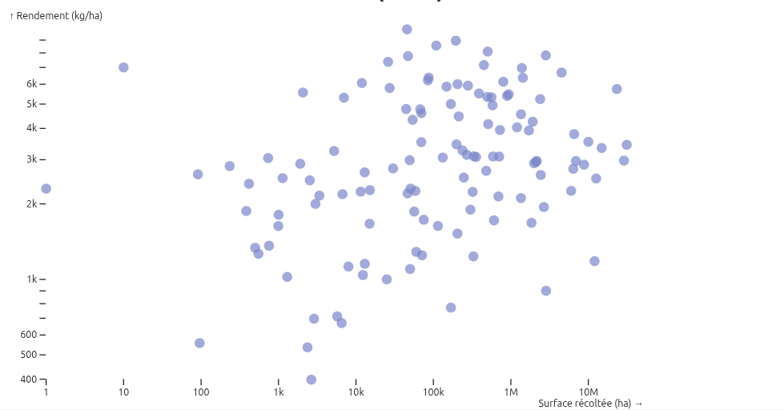
*Surface récoltée vs Rendement — Blé (2020) — Observable*

### Prototypes papier

| Prototype 1 — Version initiale | Prototype 2 — Version enrichie |
|---|---|
| 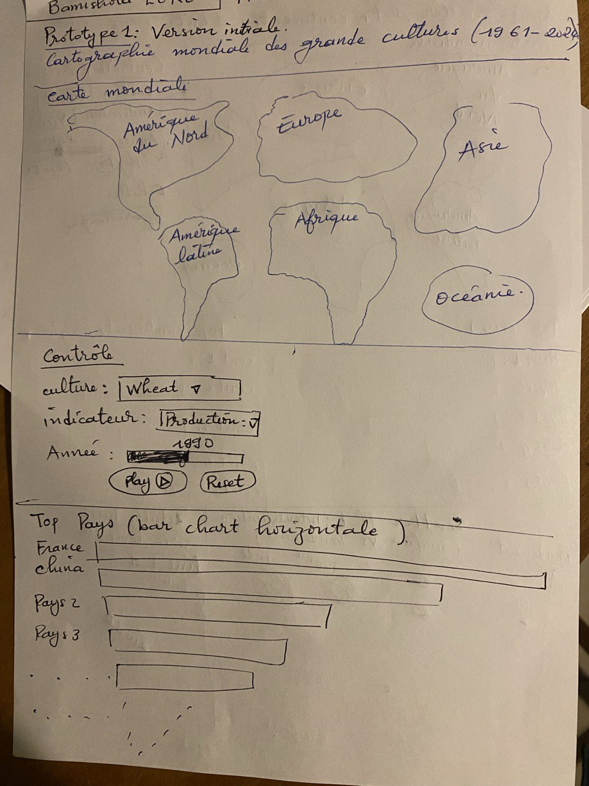 | 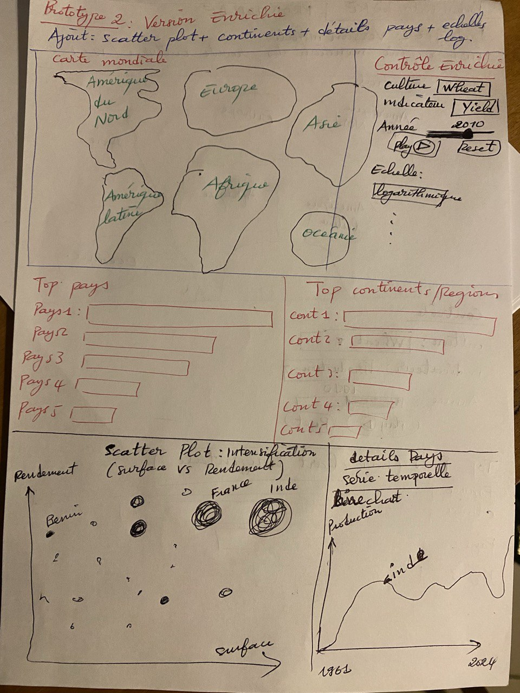 |

---

## 🎯 Fonctionnalités

### Page Dashboard
- **Carte choroplèthe mondiale** — encodage par production, surface récoltée ou rendement, avec animation temporelle (Play/Reset), zoom interactif et 2 modes d'échelle (linéaire / racine carrée √)
- **Classements Top Pays / Top Continents** — bar charts synchronisés, slider Top N (5 à 30 pays)
- **Scatter plot d'intensification agricole** — surface (log) vs rendement (log), taille des bulles = production totale, clic pour sélectionner un pays
- **Comparaison temporelle multi-pays** — line chart multi-couleurs, sélection simultanée de plusieurs pays (1961–2024)

### Page Détails pays
- 3 KPI cards (production, surface, rendement) pour l'année sélectionnée
- Bar chart comparant toutes les cultures disponibles
- Line chart multi-cultures 1961–2024 avec couleurs distinctes

### Page Statistiques
- 2 donut charts interactifs : répartition par culture et par continent
- Area chart empilé des parts de marché relatives par culture (1961–2024)
- Ligne verticale synchronisée avec l'année sélectionnée

---

## 🗂️ Structure du projet

```
prodmonde/
├── index.html                          # Application principale
├── main.js                             # Visualisations D3.js (~2000 lignes)
├── styles.css                          # Styles
├── rapport_visu_PRODMONDE.pdf          # Rapport du projet
├── data/
│   ├── main2.py                        # Script Python de prétraitement
│   ├── my_faostat_subset_long.csv      # Dataset final (format long, 217 389 lignes)
│   └── Production_Crops_Livestock_E_All_Data/
│       ├── Production_Crops_Livestock_E_All_Data.csv
│       ├── Production_Crops_Livestock_E_All_Data_NOFLAG.csv
│       ├── Production_Crops_Livestock_E_AreaCodes.csv
│       ├── Production_Crops_Livestock_E_Elements.csv
│       ├── Production_Crops_Livestock_E_Flags.csv
│       └── Production_Crops_Livestock_E_ItemCodes.csv
└── image_visu/
    ├── demo_carte.png
    ├── demo_top_pays.png
    ├── demo_scatter_comparaison.png
    ├── demo_details_pays.png
    ├── demo_statistiques_donuts.png
    ├── demo_area_chart.png
    ├── obs_production_totale.png
    ├── obs_ble_temporel.png
    ├── obs_top10_ble.png
    ├── obs_scatter_ble.png
    ├── prototype1.png
    └── prototype2.png
```

---

## 🔧 Stack technique

| Composant | Technologie |
|---|---|
| Visualisation | D3.js v7 |
| Cartographie | TopoJSON + Natural Earth |
| Langage | HTML / CSS / JavaScript pur (sans framework) |
| Prétraitement | Python / pandas (`data/main2.py`) |
| Déploiement | GitHub Pages + domaine personnalisé |

---

## 📦 Dataset

Le fichier `my_faostat_subset_long.csv` est le seul fichier chargé par l'application.
Produit par `data/main2.py` à partir du fichier brut FAOSTAT (`_All_Data_NOFLAG.csv`).

| Dimension | Valeur |
|---|---|
| Lignes | 217 389 |
| Cultures | 9 — Barley, Maize, Oil palm fruit, Potatoes, Rice, Soya beans, Sugar cane, Wheat, Yams |
| Indicateurs | 3 — Surface récoltée (ha), Rendement (kg/ha), Production (t) |
| Zones géographiques | 237 (pays + agrégats régionaux) |
| Période | 1961 – 2024 |

---

## ⚠️ Limites connues

- Données 2024 partielles pour certains pays (non encore publiées par la FAO)
- Correspondance noms FAOSTAT / TopoJSON réalisée via dictionnaire manuel (quelques pays non colorés)
- Dataset chargé intégralement côté client — temps de chargement initial variable selon la connexion
- Agrégats régionaux (World, Europe, Asia…) filtrés des cartes mais inclus dans Top Continents
- Rendement exprimé en kg/ha pour toutes les cultures (normalisation FAO)

---

## 📝 Crédits et sources

| Ressource | Source | Lien |
|---|---|---|
| Données agricoles | FAOSTAT – QCL, FAO/Nations Unies | [fao.org](https://www.fao.org/faostat/en/#data/QCL) |
| Géographie mondiale | Natural Earth via TopoJSON World Atlas | [github.com/topojson/world-atlas](https://github.com/topojson/world-atlas) |
| Visualisation | D3.js v7 – Mike Bostock | [d3js.org](https://d3js.org/) |
| Cartographie | TopoJSON – Mike Bostock | [github.com/topojson/topojson](https://github.com/topojson/topojson) |
| Exploration | Observable Plot | [observablehq.com/plot](https://observablehq.com/plot/) |

---

Projet réalisé dans le cadre du cours **MOS 9.1 – Visualisation Interactive de Données**
École Centrale Lyon, 2025-2026
**Encadrants :** Romain Vuillemot, Théo Jaunet, Romuald Thion
```